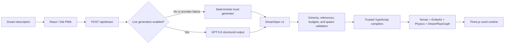

# DreamCraft

> Describe a dream. Step into a playable world.

DreamCraft turns a plain-English dream into a short first-person voxel game:
terrain, a procedural character, strange physics, dialogue, an objective, and a
real ending. It is a browser-first OpenAI Build Week 2026 project for the
**Apps for Your Life** track.

| Judge link | Status |
| --- | --- |
| Live demo | **PENDING — no Vercel preview or production URL exists yet** |
| Demo video | **PENDING — public under-three-minute video not recorded/uploaded** |
| Repository | [github.com/joyboy257/dreamcraft](https://github.com/joyboy257/dreamcraft) |

G0–G6 are locally certified. G7 release preparation is in progress. The GPT-5.6
runtime is engineering-complete but its locked ten-prompt live proof is still
pending a rotated key, funding, and explicit authorization. The deterministic
local generator is the mandatory fallback and requires no account or API key.

## What judges can do

1. Choose a sample dream or describe a place, strange rule, and character.
2. Select Calm, Vivid, or Fever intensity and choose **Enter Dream**.
3. If **Stable fragment** appears, choose **Enter the fragment**; this is the
   intentional API-disabled/failure fallback, not a dead end.
4. Choose **Step into the dream**, press `E` to meet the guide, select
   **Follow the dream**, then press `E` again to awaken the fragment.
5. Reach the ending and use Replay, Remix this dream, or Remember another.

Expected time: about 60–90 seconds. Desktop controls are `WASD` to move, mouse
to look, `Space` to jump/rise, `Shift` to sprint, `E` or click to interact, and
`Esc` to pause. Touch movement, look, jump, and interaction controls appear on
mobile.

The full judge path is in
[`docs/11_DEMO_AND_SUBMISSION.md`](docs/11_DEMO_AND_SUBMISSION.md).

## Sample prompts

- **Tiny wonder:** “I was tiny in a moonlit kitchen where teacups floated and a
  patient moth guarded the sugar bowl.”
- **Lost messages:** “A flooded school repeated forever while paper boats
  carried messages from my childhood dog.”
- **Golden celebration:** “My family celebrated beneath a golden rainstorm as
  the city buildings slowly turned into instruments.”

The same normalized description and intensity always produce the same local
fragment. This makes the fallback reproducible for judging and testing.

## Architecture



DreamSpec is bounded declarative data. GPT-5.6 describes the world using
allowlisted structures, entities, physics, dialogue, effects, and story beats;
trusted TypeScript code decides how those values behave. DreamCraft never runs
model-generated JavaScript, imports, shaders, callbacks, or URLs. This boundary
makes worlds reproducible, validates resource budgets before rendering, and
keeps gameplay independent of the model after generation.

The client renders combined exposed-face chunk geometry rather than one mesh per
block. The central chunk is prepared first, outer chunk work is bounded, and
desktop/mobile quality profiles cap draw work and particles.

More detail: [`docs/01_SYSTEM_ARCHITECTURE.md`](docs/01_SYSTEM_ARCHITECTURE.md),
[`docs/02_DREAMSPEC_DSL.md`](docs/02_DREAMSPEC_DSL.md), and
[`docs/10_SECURITY_AND_RELIABILITY.md`](docs/10_SECURITY_AND_RELIABILITY.md).

## How Codex and GPT-5.6 are used

Codex built the repository through evidence-backed gates:

- **Sol** owns architecture, scope, integration, Git checkpoints, and final
  release review.
- **Luna** handles bounded implementation, tests, documentation, and routine
  fixes.
- **Terra** handles difficult systems/debugging, security review, and independent
  gate verification.

Work is sequential through G7, and a gate is not complete until its commands and
evidence are reproduced. At runtime, `single-sol` is the default GPT-5.6 path.
The feature-flagged Sol → Terra/Luna director pipeline remains experimental
because mocked evaluation did not prove enough quality gain to justify extra
calls. Model output is complete before play begins.

The live runtime proof has **not** been run. Mocked success, timeout,
cancellation, refusal, malformed output, rate-limit, authentication, quota, and
API-disabled paths are covered, and each failure reaches the local generator.
See [`docs/14_G3_ENGINEERING_EVIDENCE.md`](docs/14_G3_ENGINEERING_EVIDENCE.md)
and [`docs/13_G3_LIVE_VALIDATION_RUNBOOK.md`](docs/13_G3_LIVE_VALIDATION_RUNBOOK.md).

## Local setup

Requirements:

- Node.js `24.18.0` (`>=24 <25`)
- Corepack and project-pinned pnpm `11.13.0`

```bash
git clone https://github.com/joyboy257/dreamcraft.git
cd dreamcraft
corepack enable
corepack pnpm install --frozen-lockfile
corepack pnpm dev
```

Open `http://localhost:5173`. No `.env.local` file is required for the safe
local path.

### Environment

`.env.example` is authoritative. If local configuration is needed, copy it to
the ignored `.env.local`; never commit that file.

| Variable | Purpose | Safe default |
| --- | --- | --- |
| `OPENAI_API_KEY` | Server-only OpenAI credential | unset |
| `DREAMCRAFT_OPENAI_ENABLED` | Literal live-generation kill switch | `false` |
| `DREAMCRAFT_ENABLE_DIRECTOR_PIPELINE` | Experimental multi-stage generation | `false` |
| `DREAMCRAFT_GENERATION_STRATEGY` | Server strategy allowlist | `single-sol` |
| `DREAMCRAFT_REQUEST_TIMEOUT_MS` | Server request deadline | `12000` |
| `DREAMCRAFT_MAX_DREAM_CHARS` | Input limit | `1200` |
| `DREAMCRAFT_MAX_BODY_BYTES` | Request-body limit | `8192` |
| `DREAMCRAFT_ENABLE_DEBUG_METRICS` | Safe structured server metrics | `false` |

Never use a `VITE_*` name for a secret; Vite variables are shipped to the
browser. A key alone cannot enable calls: the server requires both a key and the
literal `DREAMCRAFT_OPENAI_ENABLED=true` gate.

## Commands and evidence

| Command | Purpose |
| --- | --- |
| `corepack pnpm dev` | Start Vite and the local `/api/dream` development route |
| `corepack pnpm typecheck` | Strict TypeScript check |
| `corepack pnpm lint` | ESLint with zero warnings |
| `corepack pnpm test` | Unit and integration tests |
| `corepack pnpm eval` | DreamSpec and generation evals |
| `corepack pnpm test:e2e` | Serialized desktop/mobile Chromium journeys |
| `corepack pnpm test:pwa` | Production build plus offline PWA test |
| `corepack pnpm build` | Typecheck and create Vite output in `dist/` |
| `corepack pnpm test:smoke-deployed` | Test the deployed-smoke validator itself |
| `corepack pnpm smoke:deployed -- https://preview.example` | Verify a generation-disabled deployment |
| `bash scripts/validate-pack.sh` | Validate required files and scan nonignored files safely |
| `node --check public/sw.js` | Validate service-worker syntax |
| `corepack pnpm audit --prod --audit-level high` | Audit production dependencies |

Gate evidence lives in `docs/12_*` through `docs/18_*`. G6 passed 192/192
unit/integration tests, 6/6 eval tests, the serialized 9/9 browser matrix, 1/1
production PWA test, and an independent Terra review. Current G7 changes remain
unreleased until their own review and release checks finish.

## Fallback, security, and privacy

- No account, database, analytics tracker, file upload, or PII persistence is
  required.
- Dream descriptions are bounded and normalized. Server metrics omit raw dream
  text, credentials, authorization headers, and stack traces.
- `/api/dream` accepts same-origin JSON POSTs only, uses bounded body/input/model
  budgets, and returns `no-store` responses.
- Model data crosses strict schema, cross-reference, budget, spawn-safety, and
  client validation before trusted compilers consume it.
- The service worker caches the application shell but excludes every `/api/`
  response.
- CSP, HSTS, framing, MIME, referrer, permissions, opener/resource, and API
  cache headers are configured for Vercel.
- Live public generation additionally requires Vercel Firewall/shared rate
  protection because the application limiter is process-local on serverless
  instances.

Security details and residual risks are recorded in
[`docs/18_G6_ENGINEERING_EVIDENCE.md`](docs/18_G6_ENGINEERING_EVIDENCE.md).

## Performance and accessibility

The certified deterministic Chromium profile measured approximately 119 FPS on
desktop balanced and 120 FPS under Pixel 7 reduced emulation, with frame p95
below 17 ms and 10 ms respectively, fewer than 25 draw calls, fewer than 12,000
visible triangles, and chunk work below 5 ms p95. These are synthetic release
guards, not real-user monitoring. The raw client bundle remains above Vite’s
500 kB advisory at 980.52 kB (271.31 kB gzip).

Keyboard focus containment, reduced motion, high-contrast HUD, audio text
alternatives, FOV/sensitivity controls, pause/escape recovery, and mobile touch
paths are automated. Physical-device GPU, thermal, and ergonomic checks remain
G7 release work.

## Deployment

Vercel is the selected Vite/serverless host: Node 24, frozen pnpm install,
`corepack pnpm build`, and `dist/`. Preview must be created first with live generation
disabled and **no OpenAI key**. Production deployment requires explicit owner
authorization. Funding/rotating a key and running the live ten-prompt proof are
separate later actions.

Exact preview, smoke, production, and rollback steps are in
[`docs/19_RELEASE_AND_ROLLBACK_RUNBOOK.md`](docs/19_RELEASE_AND_ROLLBACK_RUNBOOK.md).

## License and notices

The DreamCraft repository license is **pending owner legal approval**. An
approval-ready MIT draft with the neutral holder “DreamCraft contributors” is
available at [`LICENSE-MIT-DRAFT.md`](LICENSE-MIT-DRAFT.md); it is not yet an
adopted `LICENSE` file. Direct dependency notices are in
[`THIRD_PARTY_NOTICES.md`](THIRD_PARTY_NOTICES.md).
