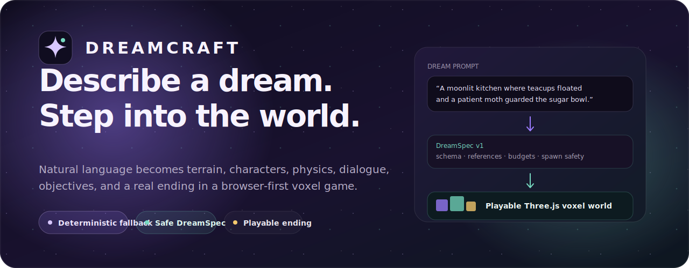
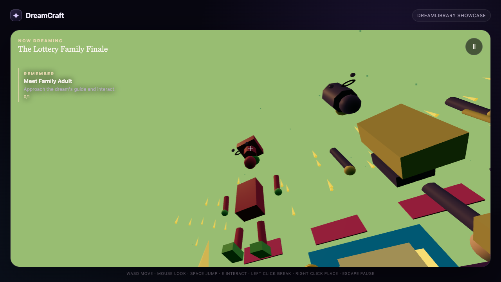
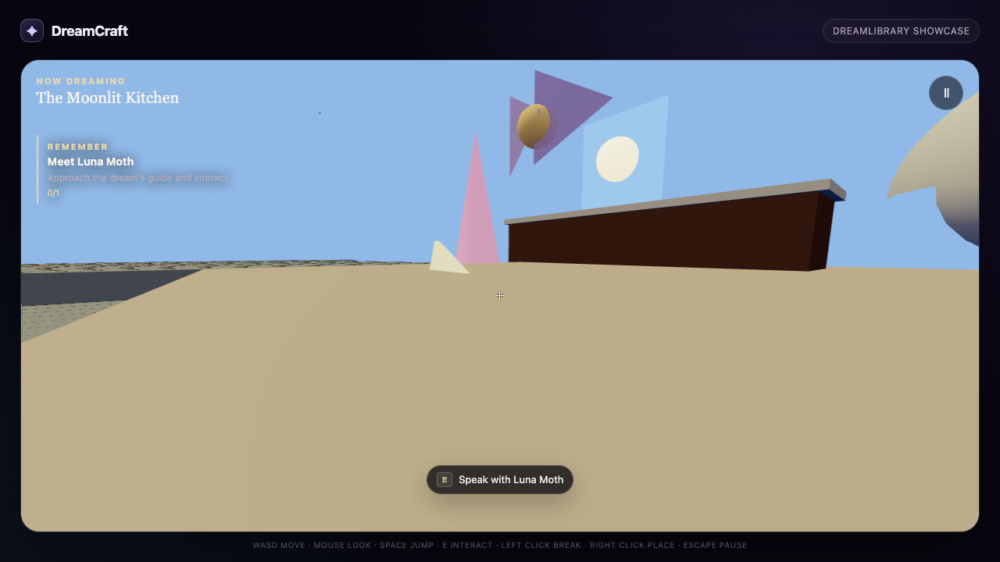
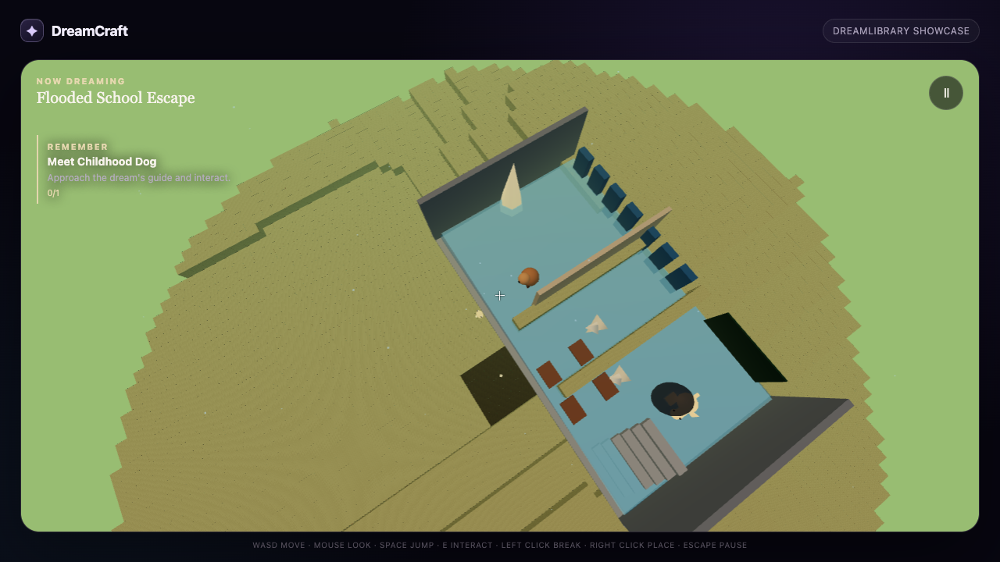
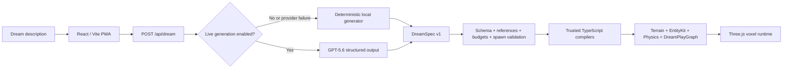

<p align="center">
  
</p>

<p align="center">
  <a href="#run-it-locally"><strong>Run locally</strong></a>
  &nbsp;&nbsp;·&nbsp;&nbsp;
  <a href="#how-a-dream-becomes-a-world"><strong>Architecture</strong></a>
  &nbsp;&nbsp;·&nbsp;&nbsp;
  <a href="#engineering-evidence"><strong>Engineering evidence</strong></a>
  &nbsp;&nbsp;·&nbsp;&nbsp;
  <a href="docs/11_DEMO_AND_SUBMISSION.md"><strong>Judge path</strong></a>
  &nbsp;&nbsp;·&nbsp;&nbsp;
  <a href="docs/00_PRODUCT_NORTH_STAR.md"><strong>Product vision</strong></a>
</p>

<p align="center">
  
  
  
  
  
</p>

<p align="center">
  <strong>DreamCraft turns a plain-English dream into a short first-person voxel game.</strong><br />
  Terrain, procedural characters, strange physics, dialogue, objectives, and a real ending—compiled safely into a browser-playable world.
</p>

> [!IMPORTANT]
> The deterministic local experience is fully playable and requires no account or API key. Public Vercel deployment and the locked live GPT-5.6 ten-prompt proof remain intentionally pending explicit owner authorization, a rotated key, and funding. Mocked provider failures are covered and always fall back to the local generator.

## See the worlds

<table>
  <tr>
    <td width="33%" align="center"><strong>Golden celebration</strong></td>
    <td width="33%" align="center"><strong>Moonlit kitchen</strong></td>
    <td width="33%" align="center"><strong>Messages from a dog</strong></td>
  </tr>
  <tr>
    <td></td>
    <td></td>
    <td></td>
  </tr>
</table>

Each world starts from a short description and intensity choice. DreamCraft materializes a coherent fragment with recognizable entities, atmosphere, movement rules, interaction, dialogue, an objective, and an ending instead of generating a decorative scene with nothing to do.

## What makes DreamCraft different

<table>
  <tr>
    <td width="50%" valign="top">
      <h3>✦ Meaning becomes mechanics</h3>
      Dream details influence terrain, entities, materials, lighting, sound, physics, dialogue, objectives, and story beats—not only visual style.
    </td>
    <td width="50%" valign="top">
      <h3>⌁ Every world is playable</h3>
      The generated fragment includes safe spawning, navigation, interaction, a guide, a goal, progression, and a deterministic ending.
    </td>
  </tr>
  <tr>
    <td width="50%" valign="top">
      <h3>◇ Model output stays declarative</h3>
      GPT-5.6 produces bounded DreamSpec data. Trusted TypeScript compilers decide behavior; DreamCraft never executes model-generated JavaScript, shaders, callbacks, imports, or URLs.
    </td>
    <td width="50%" valign="top">
      <h3>↻ Failure still produces a world</h3>
      API-disabled, timeout, refusal, rate-limit, authentication, quota, and malformed-output paths all converge on the deterministic local generator.
    </td>
  </tr>
</table>

## The 60-second experience

1. Describe a place, a strange rule, and a character—or choose a sample dream.
2. Select **Calm**, **Vivid**, or **Fever** intensity.
3. Enter the generated fragment.
4. Explore with first-person movement and meet the dream guide.
5. Follow the objective, awaken the fragment, and reach the ending.
6. Replay, remix the dream, or remember another.

Desktop controls: `WASD` to move, mouse to look, `Space` to jump or rise, `Shift` to sprint, `E` or click to interact, and `Esc` to pause. Mobile receives dedicated movement, look, jump, and interaction controls.

## Sample dreams

> **Tiny wonder**<br />
> “I was tiny in a moonlit kitchen where teacups floated and a patient moth guarded the sugar bowl.”

> **Lost messages**<br />
> “A flooded school repeated forever while paper boats carried messages from my childhood dog.”

> **Golden celebration**<br />
> “My family celebrated beneath a golden rainstorm as the city buildings slowly turned into instruments.”

The same normalized prompt and intensity always produce the same deterministic fallback fragment, making the safe path reproducible for testing and judging.

## How a dream becomes a world



### DreamSpec v1

DreamSpec is bounded declarative data describing:

- terrain, structures, materials, atmosphere, and effects;
- recognizable procedural entities and their roles;
- movement, gravity, buoyancy, friction, jump, and world physics;
- dialogue, interactions, objectives, progression, and endings;
- hard budgets for world size, entities, particles, references, and spawn safety.

Every specification passes schema, cross-reference, resource-budget, semantic, and spawn validation before trusted compilers materialize it.

### Runtime compilation

The runtime converts validated DreamSpec into:

- exposed-face chunk geometry instead of one mesh per block;
- bounded terrain streaming and prioritized central chunks;
- procedural entity geometry through EntityKit;
- physics profiles and DreamPlayGraph mechanics;
- adaptive desktop and mobile quality profiles;
- procedural atmosphere and audio;
- deterministic interaction and story-state transitions.

Read the deeper design in:

- [`docs/01_SYSTEM_ARCHITECTURE.md`](docs/01_SYSTEM_ARCHITECTURE.md)
- [`docs/02_DREAMSPEC_DSL.md`](docs/02_DREAMSPEC_DSL.md)
- [`docs/03_PHYSICS_DSL.md`](docs/03_PHYSICS_DSL.md)
- [`docs/04_ENTITYKIT.md`](docs/04_ENTITYKIT.md)
- [`docs/05_DREAMPLAYGRAPH.md`](docs/05_DREAMPLAYGRAPH.md)

## Recruiter quick scan

| | |
| --- | --- |
| **Product** | Natural-language-to-playable-world browser game built for OpenAI Build Week 2026. |
| **My role** | Product design, system architecture, engine design, AI pipeline, orchestration, testing, security, performance, and release engineering. |
| **Core technical problem** | Convert open-ended dream language into bounded, semantically faithful, safe, performant gameplay—not arbitrary generated code. |
| **Stack** | React 19, TypeScript 6, Three.js, Vite, Zod, OpenAI structured output, Vitest, Playwright, PWA service worker, Vercel serverless routes. |
| **Reliability model** | Deterministic fallback, strict schemas, resource budgets, same-origin server API, no raw text in metrics, no API responses in offline cache. |
| **Agentic build model** | Sol architecture/integration, Luna bounded implementation, Terra systems/debugging and independent gate review. |

## Engineering evidence

DreamCraft was built through evidence-backed gates rather than a single demo sprint.

| Certified local gate evidence | Result |
| --- | ---: |
| Unit and integration tests | **192 / 192** |
| DreamSpec and generation evals | **6 / 6** |
| Serialized desktop/mobile browser matrix | **9 / 9** |
| Production PWA/offline test | **1 / 1** |
| Independent systems review | **Passed** |
| Desktop balanced synthetic profile | **≈119 FPS** |
| Pixel 7 reduced synthetic profile | **≈120 FPS** |
| Draw-call release guard | **<25** |
| Visible-triangle release guard | **<12,000** |
| Chunk-work p95 release guard | **<5 ms** |

The performance figures are synthetic Chromium release guards, not real-user monitoring. Physical-device GPU, thermal, and ergonomic checks remain release work. The raw client bundle also remains above Vite's 500 kB advisory at 980.52 kB, or 271.31 kB gzip.

Evidence lives in [`docs/14_G3_ENGINEERING_EVIDENCE.md`](docs/14_G3_ENGINEERING_EVIDENCE.md) through [`docs/21_G7_1_SEMANTIC_GROUNDING_EVIDENCE.md`](docs/21_G7_1_SEMANTIC_GROUNDING_EVIDENCE.md).

## Security and privacy boundary

- No account, database, analytics tracker, file upload, or PII persistence is required.
- Dream descriptions are bounded and normalized.
- Server metrics omit raw dream text, credentials, authorization headers, and stack traces.
- `/api/dream` accepts same-origin JSON POST requests only and returns `no-store` responses.
- A server-side key cannot activate generation by itself; `DREAMCRAFT_OPENAI_ENABLED=true` is also required.
- Model output passes strict schema, reference, budget, semantic, and spawn validation.
- The service worker caches the application shell but excludes every `/api/` response.
- CSP, HSTS, framing, MIME, referrer, permissions, opener/resource, and cache headers are configured for Vercel.

Read [`docs/10_SECURITY_AND_RELIABILITY.md`](docs/10_SECURITY_AND_RELIABILITY.md) and [`docs/18_G6_ENGINEERING_EVIDENCE.md`](docs/18_G6_ENGINEERING_EVIDENCE.md).

## Run it locally

Requirements:

- Node.js `24.18.0` or another version in `>=24 <25`
- Corepack
- project-pinned pnpm `11.13.0`

```bash
git clone https://github.com/joyboy257/dreamcraft.git
cd dreamcraft
corepack enable
corepack pnpm install --frozen-lockfile
corepack pnpm dev
```

Open `http://localhost:5173`. The safe local path requires no `.env.local`, account, or API key.

## Useful commands

| Command | Purpose |
| --- | --- |
| `corepack pnpm dev` | Start Vite and the local `/api/dream` route |
| `corepack pnpm typecheck` | Strict TypeScript verification |
| `corepack pnpm lint` | ESLint with zero warnings |
| `corepack pnpm test` | Unit and integration suite |
| `corepack pnpm eval` | DreamSpec and generation evaluations |
| `corepack pnpm test:e2e` | Serialized desktop/mobile browser journeys |
| `corepack pnpm test:pwa` | Production build and offline PWA journey |
| `corepack pnpm build` | Typecheck and produce the Vite bundle |
| `bash scripts/validate-pack.sh` | Validate the repository and scan nonignored files |
| `corepack pnpm audit --prod --audit-level high` | Audit production dependencies |

## Runtime configuration

`.env.example` is authoritative. Secrets never use a `VITE_*` name because Vite variables are shipped to the browser.

| Variable | Purpose | Safe default |
| --- | --- | --- |
| `OPENAI_API_KEY` | Server-only OpenAI credential | unset |
| `DREAMCRAFT_OPENAI_ENABLED` | Literal live-generation kill switch | `false` |
| `DREAMCRAFT_ENABLE_DIRECTOR_PIPELINE` | Experimental multi-stage generation | `false` |
| `DREAMCRAFT_GENERATION_STRATEGY` | Server strategy allowlist | `single-sol` |
| `DREAMCRAFT_REQUEST_TIMEOUT_MS` | Server request deadline | `12000` |
| `DREAMCRAFT_MAX_DREAM_CHARS` | Input limit | `1200` |
| `DREAMCRAFT_MAX_BODY_BYTES` | Request-body limit | `8192` |
| `DREAMCRAFT_ENABLE_DEBUG_METRICS` | Safe structured server metrics | `false` |

## Current release status

<details>
<summary><strong>Open release gates and judge status</strong></summary>

<br />

| Surface | Current status |
| --- | --- |
| Local deterministic experience | **Certified and playable** |
| GPT-5.6 runtime implementation | **Engineering-complete** |
| Locked ten-prompt live provider proof | **Pending rotated key, funding, and authorization** |
| Vercel deployment and alias | **Pending explicit production authorization** |
| Public under-three-minute demo video | **Pending** |
| Physical-device GPU and thermal checks | **Pending G7 release work** |
| Repository license | **Pending owner legal approval** |

G0–G6 are locally certified. G7 release preparation is in progress. Exact preview, smoke, production, and rollback steps are in [`docs/19_RELEASE_AND_ROLLBACK_RUNBOOK.md`](docs/19_RELEASE_AND_ROLLBACK_RUNBOOK.md).

The feature-flagged Sol → Terra/Luna director runtime remains experimental because mocked evaluation did not prove sufficient quality improvement to justify additional model calls. `single-sol` remains the default live strategy.

</details>

## Documentation map

| Topic | Document |
| --- | --- |
| Product north star | [`docs/00_PRODUCT_NORTH_STAR.md`](docs/00_PRODUCT_NORTH_STAR.md) |
| System architecture | [`docs/01_SYSTEM_ARCHITECTURE.md`](docs/01_SYSTEM_ARCHITECTURE.md) |
| DreamSpec DSL | [`docs/02_DREAMSPEC_DSL.md`](docs/02_DREAMSPEC_DSL.md) |
| Physics DSL | [`docs/03_PHYSICS_DSL.md`](docs/03_PHYSICS_DSL.md) |
| Procedural entities | [`docs/04_ENTITYKIT.md`](docs/04_ENTITYKIT.md) |
| Gameplay graph | [`docs/05_DREAMPLAYGRAPH.md`](docs/05_DREAMPLAYGRAPH.md) |
| UI and game feel | [`docs/07_PRODUCT_UI_AND_GAME_FEEL.md`](docs/07_PRODUCT_UI_AND_GAME_FEEL.md) |
| Performance budgets | [`docs/08_PERFORMANCE_BUDGETS.md`](docs/08_PERFORMANCE_BUDGETS.md) |
| Test and evaluation plan | [`docs/09_TEST_AND_EVAL_PLAN.md`](docs/09_TEST_AND_EVAL_PLAN.md) |
| Security and reliability | [`docs/10_SECURITY_AND_RELIABILITY.md`](docs/10_SECURITY_AND_RELIABILITY.md) |
| Demo and submission path | [`docs/11_DEMO_AND_SUBMISSION.md`](docs/11_DEMO_AND_SUBMISSION.md) |

## License

The repository license remains pending owner legal approval. [`LICENSE-MIT-DRAFT.md`](LICENSE-MIT-DRAFT.md) is an approval-ready draft and is not yet an adopted license. Direct dependency notices are recorded in [`THIRD_PARTY_NOTICES.md`](THIRD_PARTY_NOTICES.md).
